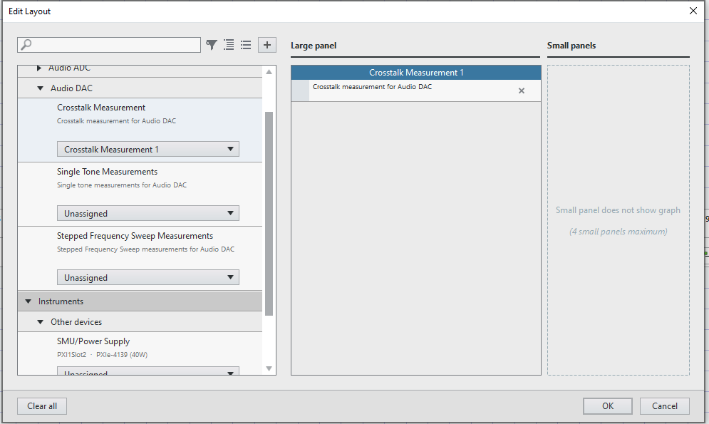
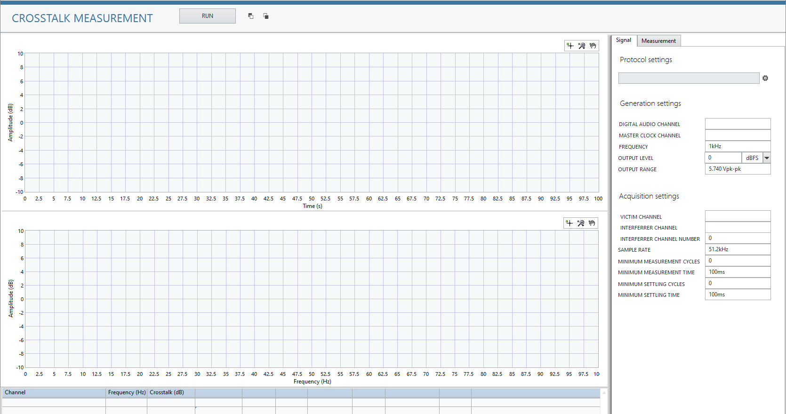

# Crosstalk measurement
This service performs Crosstalk measurement
## Tested Hardware Setup 1

  

## InstrumentStudio Panel

### Usage

1. Select appropriate resource names, data line and channel according to the hardware setup and update other parameters as needed. Ensure the protocol settings are good. 

   

2. Run the measurement. The calculated crosstalk value displayed in a table along with the Time domain and frequency domain of Interferrer and victim channels

   
3. The generated and acquired signals can be seen from time domain and frequency domain graphs.
   
